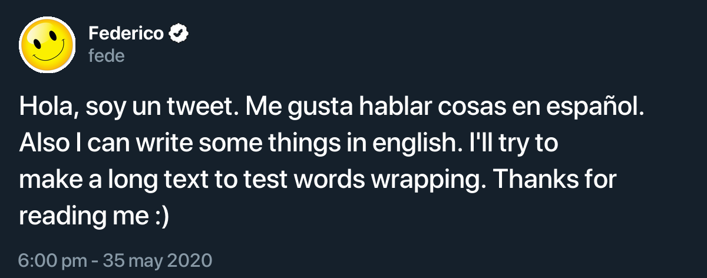

# tweet-image-generator
A tool to generate tweets images

### Instalation
```
git clone https://github.com/fedejordan/tweet-image-generator.git
cd tweet-image-generator
python3 -m venv env
source env/bin/activate
pip install requirements.txt
```

### Usage
```
python generate-tweet-image.py --twitter-name "Federico" --twitter-account "fede" --text "Hola, soy un tweet. Me gusta hablar cosas en espaol. Also I can write some things in english. I'll try to make a long text to test words wrapping. Thanks for reading me :) federicojordan.github.io" --date-text "6:00 pm - 35 may 2020" --image-url "https://i.pinimg.com/originals/b9/f3/15/b9f31565dd0c1997e22aa6186be88912.jpg" --is-verified true --images https://q-cf.bstatic.com/images/hotel/max1024x768/220/220680927.jpg
```

This will generate an image like this:

</img>

### Roadmap
- Light mode
- Tweets with photos (more than 1)
